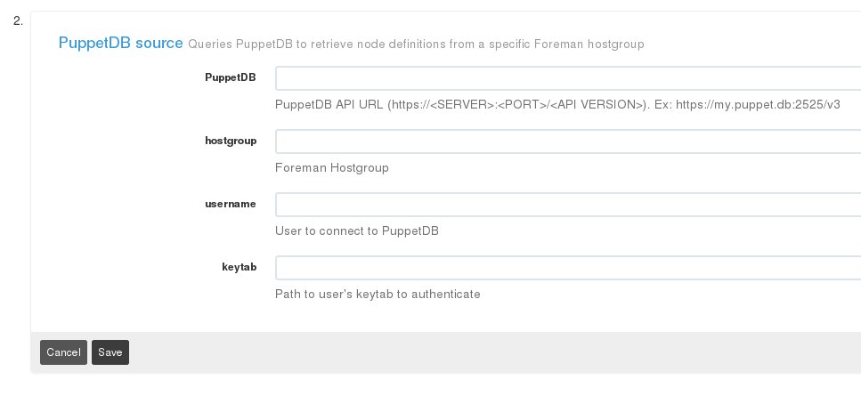

Rundeck PuppetDB Nodes Plugin
=============================================

Description
-----------
This is a Resource Model Source plugin for [Rundeck][] Rundeck version 2.0 (or higher) that retrieves node definitions
from PuppetDB. 

Developed in Python, it uses [python-requests][] library and Kerberos authentication to connect to the PuppetDB API.

[RunDeck]: http://rundeck.org
[python-requests]: http://docs.python-requests.org/en/latest/

Either the puppetdb API url, the foreman hostgroup, username, and the kerberos keytab path can be specified via plugin parameters on the project's configuration page.

Parameters
----------
`PuppetDB` - PuppetDB API URL following this format: `https://<SERVER>:<PORT>/<API VERSION>` 

 > `https://my.puppet.db:2525/v3`

`Foreman Hostgroup` - Specify a Foreman hosgroup to filter the query

 > `cloud_workflows` or `cloud_`

`Kerberos user` - User to connect to PuppetDB

`Kerberos keytab` - Path to user's keytab to authenticate



Requirements
------------
* The plugin requires Rundeck version 2.0 or higher.
* python-requests v1.1.0-4
* python-requests-kerberos v0.5 ([important!!](https://bugzilla.redhat.com/show_bug.cgi?id=1169296))

Installation
------------
Download the latest .ZIP from the [releases page](https://github.com/cernops/rundeck-puppetdb-nodes/releases) and copy it to `/var/lib/rundeck/libext/`. Restart the Rundeck service to be sure it gets the lastest changes.

Next time you log in, you will see a new Resource Model Source called **PuppetDB Source** on the project's configuration page.

Plugin Output example
---------------------
```
scheduler-02.mydomain.com:
    hostname: scheduler-02.mydomain.com
    username: root
    tags:  hostgroup=workflows/scheduler/server
    osName: SLC
scheduler-01.mydomain.com:
    hostname: scheduler-01.mydomain.com
    username: root
    tags:  hostgroup=workflows/scheduler/server
    osName: SLC
loadbalancer-01.mydomain.com:
    hostname: loadbalancer-01.mydomain.com
    username: root
    tags:  hostgroup=workflows/ha
    osName: SLC
server-02.mydomain.com:
    hostname: server-02.mydomain.com
    username: root
    tags:  hostgroup=workflows/server/production
    osName: SLC
loadbalancer-02.mydomain.com:
    hostname: loadbalancer-02.mydomain.com
    username: root
    tags:  hostgroup=workflows/ha
    osName: SLC
server-qa-01.mydomain.com:
    hostname: server-qa-01.mydomain.com
    username: root
    tags:  hostgroup=workflows/server/qa
    osName: SLC
loadbalancer-qa-01.mydomain.com:
    hostname: loadbalancer-qa-01.mydomain.com
    username: root
    tags:  hostgroup=workflows/ha
    osName: SLC
server-qa-03.mydomain.com:
    hostname: server-qa-03.mydomain.com
    username: root
    tags:  hostgroup=workflows/server
    osName: CentOS
server-datastore.mydomain.com:
    hostname: server-datastore.mydomain.com
    username: root
    tags:  hostgroup=workflows/datastore
    osName: CentOS
server-qa-02.mydomain.com:
    hostname: server-qa-02.mydomain.com
    username: root
    tags:  hostgroup=workflows/server
    osName: SLC
```
